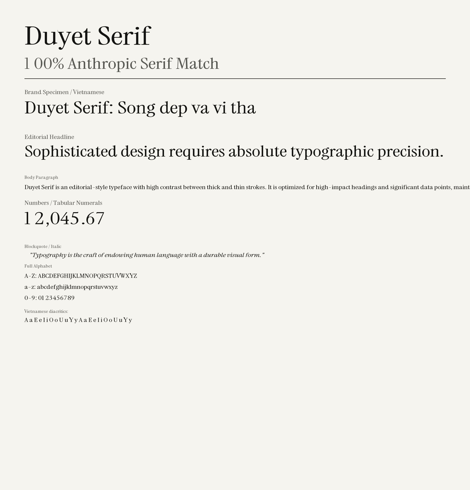

# Duyet Fonts

A collection of custom typefaces and editorial-style fonts.

**Live Demo:** [https://duyet.github.io/fonts/](https://duyet.github.io/fonts/)

## Preview



## Fonts Included

### 1. Duyet Serif
A high-contrast editorial serif based on [Instrument Serif](https://github.com/Instrument/instrument-serif). Optimized for data-heavy projects, high-impact headings, and a Zen aesthetic.

- **Proportions**: Widen +15%, Shorten -15% for grounded readability
- **Language support**: Latin extended + full Vietnamese (Ăă, Đđ, Ĩĩ, Ũũ, Ơơ, Ưư + tones)
- **Features**: ligatures, small caps, case-sensitive forms, localized forms (Catalan, Romanian, Turkish, etc.)

## Installation

```bash
npm install @duyet/fonts
```

## Usage

Import the specific font CSS in your project:

```javascript
import '@duyet/fonts/fonts/duyet-serif/index.css';
```

Then use it in your CSS:

```css
body {
  font-family: 'Duyet Serif', serif;
}
```

## Development

The project uses `fontmake` to build fonts from source.

```bash
# Install dependencies
uv pip install -r requirements.txt

# Build all fonts
make build

# Build a specific font
make duyet-serif

# Run fontbakery quality checks
make test

# Widen glyphs by 15%
make widen
```

## Repository Structure

```
├── fonts/                    # Compiled output (.ttf, .woff2)
│   └── duyet-serif/
│       ├── ttf/
│       └── woff2/
├── sources/                  # Font source files (.glyphs)
│   └── duyet-serif/
├── scripts/                  # Build & automation scripts
│   ├── generate_vi.py        # Generate Vietnamese glyphs
│   ├── inject_vi.py          # Inject combining marks
│   ├── add_anchors.py        # Add mark anchors
│   ├── fix_vi_alignment.py   # Fix VI diacritic alignment
│   ├── fix_metrics.py        # Fix vertical metrics for GF
│   ├── set_metrics.py        # Set source metrics
│   ├── widen_font.py         # Widen glyphs
│   ├── refine_typeface.py    # Refine vertical proportions
│   ├── refine_contrast.py    # Optical contrast refinement
│   ├── extract_nodes.py      # Extract node data from fonts
│   ├── check_glyphs.py       # Check glyph coverage
│   └── CustomFilterGF_Latin_Vietnamese.plist
├── deploy/                   # GitHub Pages deployment
├── index.html                # Interactive specimen sheet
├── LICENSE                   # SIL Open Font License 1.1
├── Makefile                  # Build automation
├── package.json              # NPM package config
├── requirements.txt          # Python dependencies
└── README.md                 # This file

## License

Licensed under the [SIL Open Font License 1.1](LICENSE).